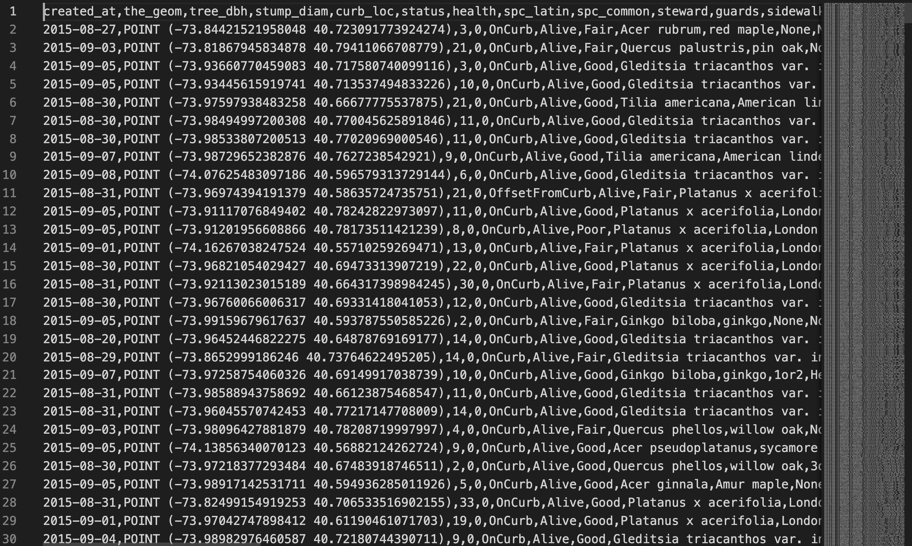

# nyc-trees
This is a work in progress.


## Table of Contents

- [Introduction](#introduction)

- [Installation](#installation)

- [Instructions](#instructions)

- [Architecture](#architecture)

- [Next steps](#next-steps)

---

## Introduction
### Description
Street tree data from the TreesCount! 2015  Tree data collected includes tree species, diameter and perception of health. Accompanying blockface data is available indicating status of data collection and data release citywide.

This is a python project for the *Department of Environmental Conservation* in New York City (NYC). In 2015 was organized a Street Tree Census, conducted by volunteers and staff organized by NYC Parks & Recreation and partner organizations.
The datasets as well as explanation are available in the following link:
[NYC Street Tree Census](https://www.nycgovparks.org/trees/treescount). 
The program allows to **clean** and **prepare the dataset** for a machine learning model.

### Objectives
- The *Department of Environmental Conservation* wants to raise awareness to ecological issues, such as climate change.
- My recommended objective: understand the determinant factors of trees health in New York City.

### When?
It is a 1 day project.
The deadline to complete it is scheduled to `10/03/2021 at 4 p.m.`.

### Visuals



## Installation
To run the program, you need:
- To install the libraries below.
- To download the example dataset `data_100000.csv` 
- Or to download a different sized dataset using the script `download.py` (written by BeCode).

### Install the libraries
| Library       | Used to                                        |
| ------------- | :----------------------------------------------|
| Sodapy        | To download the dataset                        |
| Numpy         | To handle Numpy arrays                         |
| Pandas        | To store and access info in a DataFrame        |

Follow these instructions to install the required libraries: on terminal
1. Open your terminal;
2. cd to the directory where the `requirements.txt` file is located;
3. Create and activate your virtual environment.
4. Run the command: 
```pip3 install -r requirements.txt```

### Download `data_100000.csv` or a different sized dataset using the script
- [data_100000.csv]()
- [download.py]()

Follow these instructions to see how to use the `download.py` script: on terminal
1. Open your terminal;
2. Activate your virtual environment if not activated yet;
2. cd to the directory where the `download.py` file is located;
3. Run the command:
```python download.py -h```

Save the data into the following directory:
```
core/assets
```

## Instructions
### How to run the program
Open `exploration.ipynb` jupyter notebook
to see the data exploration and preprocessing.

### Usage example
#### Example of input the user can give:
_ToDo_

#### Output of the example:
_ToDo_


## Architecture
The project is structured as follows:

```
nyc-crashes
│   README.md               :explains the project
│   main.py                 :script to run in order to start the program
│   requirements.txt        :packages to install to run the program
│   LICENSE.txt             :license information
│   .gitignore              :specifies which files to ignore when pushing to the GitHub repository
│
└───core                    :directory contains all the core scripts of the program
│   │   __init__.py
│   │   download.py         :script to download the dataset in different size (written by BeCode)
│   │   exploration.ipynb   :jupyter notebook where to follow the data exploration and preprocessing
│   │
│   └───assets              :contains the datasets and images
```

### Roadmap
- [x] Download the dataset
- [X] Explore the dataset
- [X] Clean dataset: no missing values (remove or fill in missing values)
- [ ] Clean dataset: Consolidate values
- [ ] Clean dataset: Make sure data format is correct
- [ ] Clean dataset: Trim blank spaces
- [ ] Prepare dataset for machine learning model: If necessary, add new useful features based on existing features in the dataset
- [ ] Prepare dataset for machine learning model: feature selection
- [ ] Prepare dataset for machine learning model: feature engineering
- [ ] Prepare dataset for machine learning model: feature normalization
- [ ] Prepare dataset for machine learning model: feature resampling

Depending on progress in roadmap above:
- [X] Export data into `data_clean_GOOD_ENOUGH.csv`
- [ ] Export data into `data_clean_GOOD.csv`
- [ ] Export data into `data_clean_PRECISE.csv`

Finally:
- [ ] Optimizing and automate the preprocessing steps


### Contributing
Open to contributions.
Requirements to be defined.
Instructions on how to contribute will be described in this section.


### Author(s) and acknowledgment
This project is carried out by **Van Frausum Derrick** from Theano 2.27 promotion at BeCode.
I would like to thank my colleagues and coaches at BeCode for their help and guidance.
`download.py` script is written and owned by BeCode.


## Next steps
- Determine requirements for contributions
- Add instructions on how to contribute
- Progress in roadmap: continue cleaning and preparing data
- Export data into `data_clean_GOOD.csv`
- Export data into `data_clean_PRECISE.csv`
- Optimizing and automate the preprocessing steps (in main file)
